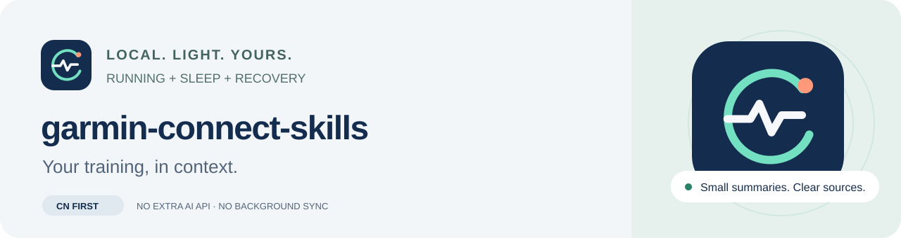

<p align="center"></p>

<p align="center"><strong>读懂跑步训练，也照顾每天的睡眠与恢复。</strong><br>中国区优先 · 本地轻量摘要 · 一个 Agent Skill · 中文周报</p>

[](https://github.com/skyswordw/garmin-connect-skills/actions/workflows/tests.yml)

把 Garmin Connect 中的跑步、睡眠、HRV 和恢复指标整理成有来源、有日期、有缺失说明的小摘要，让你使用的 AI 帮忙理解训练。也可以只用命令行查询和生成中文事实周报。

**当前为 alpha 预发布版。** 默认中国区，锁定 `garminconnect 0.3.17`。macOS、Linux、Windows 离线 CI 已通过，Windows 跳过 POSIX 权限测试。本项目尚未完成真实账号的 CN 登录、MFA、Coach 与完整用户流程验证；离线测试和安装检查不等于线上可用。遇到不支持的设备指标会明确说明。

[开始使用](#开始使用) · [接入你的-agent](#接入你的-agent) · [遇到问题](#遇到问题) · [开发与验证](#开发与验证) · [反馈问题](https://github.com/skyswordw/garmin-connect-skills/issues)

## 能帮你做什么

| 你想知道 | 获取什么 |
| --- | --- |
| 昨晚睡得如何，今天恢复怎么样？ | 睡眠、HRV、静息心率；按需增加压力、Body Battery、准备度和训练状态 |
| 最近跑步与恢复是否匹配？ | 跑步次数、距离、时长、心率等摘要，结合对应日恢复指标 |
| Coach 接下来安排了什么？ | 近期计划日程；按任务 ID 进一步读取目标和步骤 |
| 上周练得怎么样？ | 中文周报、逐项来源、日期覆盖和缺失项 |

数据事实、解释和建议分别表达。抓取失败会显示“无法确认”，不会变成“跑步 0 次”。不用提供统一配速目标，不要求采用任何笔记库结构。

## 开始使用

需要 [uv](https://docs.astral.sh/uv/getting-started/installation/)；它会按需准备 Python 3.12。下载 [alpha 预发布版](https://github.com/skyswordw/garmin-connect-skills/releases/tag/v0.1.0a1)的源码，或克隆仓库：

```sh
git clone https://github.com/skyswordw/garmin-connect-skills.git
cd garmin-connect-skills
```

### 1. 安装并先体验

```sh
uv sync --locked --no-dev
uv run --locked --no-dev garmin-skills demo
```

`demo` 完全离线，不需要账号、不读取 token。虚构周报和配套来源保存在 `demo-output/`，用于先看懂输出。

### 2. 本地登录中国区

```sh
uv run --locked --no-dev garmin-skills auth login --timezone Asia/Shanghai
```

邮箱、密码和 MFA 都在本地终端隐藏输入，不发到聊天。中国区是默认值；时区按你实际生活地区选择，账号区域不自动决定时区。成功后复用 token，下次查询不用再输密码。

### 3. 第一次查询

```sh
# 今天的睡眠、HRV、静息心率：只获取这三项
uv run --locked --no-dev garmin-skills fetch daily

# 最近 7 天的跑步摘要
uv run --locked --no-dev garmin-skills fetch runs --days 7

# 接下来 7 天的 Coach / 训练计划
uv run --locked --no-dev garmin-skills fetch plan --days 7
```

指定日期、指标，或只读已有摘要：

```sh
uv run --locked --no-dev garmin-skills fetch daily --date 2026-10-07 --metrics sleep,hrv,body_battery
uv run --locked --no-dev garmin-skills fetch runs --start 2026-09-28 --end 2026-10-04
uv run --locked --no-dev garmin-skills fetch daily --offline
```

可选指标：`sleep,hrv,rhr,stress,body_battery,readiness,training_status`。有效摘要会复用；`--refresh` 强制更新，`--offline` 始终不联网，并标记旧数据。日期范围两端包含。

### 4. 生成中文周报

```sh
# 默认上一个完整周一至周日；来源文件一起导出
uv run --locked --no-dev garmin-skills report weekly --output ~/GarminReports

# 指定周一；已有报告时生成修订版
uv run --locked --no-dev garmin-skills report weekly --week 2026-09-28 --revision --output ~/GarminReports
```

每份报告在独立文件夹中包含 `weekly.md`、`manifest.json` 和 `sources/`。报告默认防覆盖；可以在普通 Markdown 阅读器或 Obsidian 中打开。缺少部分数据仍可生成，所有输入失败时会停止，避免生成误导性的空周报。

CLI 生成可核对的事实版；主 Skill 再基于这些来源补充解释与建议。虚构数据中的跑步示例是 **3 次 / 18.5 km / 111 分钟**；某天 HRV 未提供会单独标明，不补零。

## 接入你的 Agent

先让 CLI 可以从任意目录调用：

```sh
uv tool install .
garmin-skills --version
```

如果命令未找到，执行 `uv tool update-shell` 后重新打开终端。源码环境用 uv.lock 复现；`uv tool install .` 单独解析依赖，不自动使用仓库锁文件。更多说明见 [安装与本地状态](docs/setup.md)。

把仓库中的 **`skills/garmin-connect` 整个目录**复制到 Agent 的 Skill 目录。例如 Codex：

```sh
mkdir -p ~/.codex/skills
cp -R skills/garmin-connect ~/.codex/skills/
```

Claude Code 可使用 `~/.claude/skills/`；其他支持 `SKILL.md` 的 Agent 按各自安装方式添加。目录规范兼容不代表已逐个 Agent 实测。

然后可以这样问：

> 用 Garmin Connect 看看我昨晚的睡眠和今天的恢复，区分事实和建议。
>
> 结合最近一周跑步和恢复指标，解释哪些变化值得关注。
>
> 看看 Coach 接下来有什么任务；目标不清楚时读取对应任务详情。
>
> 生成上个完整星期的中文训练周报，列出来源、截至时间和缺失项。

工具不额外接入模型 API。摘要交给哪个 Agent、是否使用云模型，由你现有的 Agent 环境决定。

## 遇到问题

| 提示 | 下一步 |
| --- | --- |
| `AUTH_REQUIRED` | 在本地运行 `auth login`；不要把密码/MFA 发到聊天 |
| `AUTH_FAILED` / `MFA_REJECTED` | 检查中国区账号、密码与验证码；MFA 有限重试，留空可取消 |
| `RATE_LIMITED` | 本次已停止请求；按冷却时间等待后手动重试，不连续重新登录 |
| `FORBIDDEN`（403） | 检查账号区域或稍后重试；不一定是密码错误 |
| `NETWORK_ERROR` | 检查网络，或使用 `--offline`；不会因此自动改用密码登录 |
| 指标未提供 / 暂不支持 | 可能与设备、同步或接口有关；其他有效数据仍可使用 |
| `INVALID_RESPONSE` | 数据结构无法可靠解释；反馈版本、命令和错误码，勿附凭据或健康 payload |
| `REPORT_EXISTS` | 原报告保留；加 `--revision` 生成新版本 |

```sh
garmin-skills doctor
garmin-skills auth status          # 仅本地检查
garmin-skills auth status --check  # 少量请求验证 token，不获取健康数据
garmin-skills auth login --reauth --strategy portal
```

目前库的 JWT-only 认证结果无法可靠跨会话保存，工具会明确报 `AUTH_MODE_UNSUPPORTED` 并保留原 token。可尝试 `portal` 或 `widget` 策略；相关边界见 [兼容性记录](docs/compatibility.md)。不要关闭 MFA 或手工粘贴 token 来绕过。

## 数据在哪里

默认使用系统的用户状态目录；环境、token 和缓存均不放进笔记库。每个账号档案、区域分别隔离，密码不落盘，token 限制本地访问但不声称已加密。

- macOS：`~/Library/Application Support/garmin-connect-skills/`
- Linux：`${XDG_STATE_HOME:-~/.local/state}/garmin-connect-skills/`
- Windows：用户本地 AppData 下的 `garmin-connect-skills/`（尚未实机验证）。

默认仅保存规范化轻量摘要，不下载 FIT/GPX/TCX、轨迹或圈段，不保留整段 API 响应。报告可以显式导出到任意目录；分享哪些健康信息由你决定。

多账号使用独立档案，例如 `garmin-skills --profile second auth login --timezone Asia/Shanghai`。国际区可显式选择 `--region global`，目前为实验性；主要验证资源投向中国区。

## 开发与验证

```sh
uv sync --locked
uv run --locked pytest
uv run --locked ruff check .
```

测试使用虚构数据和 fake transport，默认不访问 Garmin。重点验证空记录与失败、区域/账号混用、过期/覆盖、MFA/token、429/网络请求次数、计划失败和报告防覆盖。支持状态以 [兼容性记录](docs/compatibility.md) 为准。

设计和证据：[调研](docs/research.md) · [决策](docs/decisions.md) · [MVP 验收](docs/mvp.md)。开发准则见 [CONTRIBUTING.md](CONTRIBUTING.md)，版本说明见 [v0.1.0a1](docs/releases/v0.1.0a1.md)。当前没有网页、托管服务、后台同步或数据库要求。

本项目为社区工具，与 Garmin 官方无隶属关系。运动指标用于训练参考，不作医疗诊断。代码与原创图标使用 [MIT License](LICENSE)，依赖及参考项目见 [第三方说明](THIRD_PARTY_NOTICES.md)。
